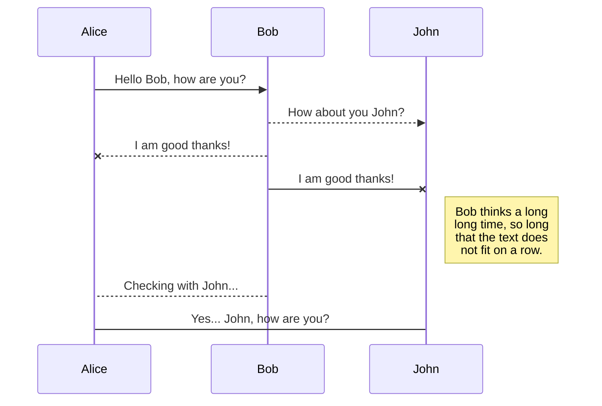
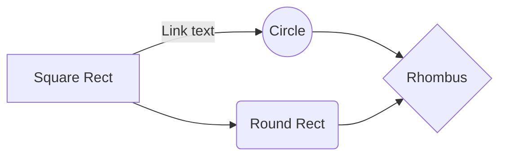

# Summary of Understanding Self-Training for Gradual Domain Adaptation

Machine learning systems must adapt to data distributions that evolve over time, in applications ranging from sensor networks and self-driving car perception modules to brain-machine interfaces. We consider gradual domain adaptation, where the goal is to adapt an initial classifier trained on a source domain given only unlabeled data that shifts gradually in distribution towards a target domain. 

We prove the first non-vacuous upper bound on the error of self-training with gradual shifts, under settings where directly adapting to the target domain can result in unbounded error. The theoretical analysis leads to algorithmic insights, highlighting that regularization and label sharpening are essential even when we have infinite data, and suggesting that self-training works particularly well for shifts with small Wasserstein-infinity distance. Leveraging the gradual shift structure leads to higher accuracies on a rotating MNIST dataset and a realistic Portraits dataset.

# 1. Overview

## What is Domain Adaptation?
**Domain adaptation** is the ability to apply an algorithm trained in one or more "source domains" to a different but related "target domain". It generally seeks to learn a model from a source labeled data that can be generalized to a target domain by minimizing the difference between domain distributions. 

Domain adaptation is a special case of transfer learning. Transfer learning refers to a class of machine learning problems where either the tasks and/or domains may change between source and target while in domain adaptations only domains differ and tasks remain unchanged.[1]

## What is Self-training?
**Self-training**, which is also known as self-learning, self-labeling, or decision-directed learning, is probably the earliest idea about using unlabeled data in classification. This is a wrapper-algorithm that repeatedly uses a supervised learning method. It starts by training on the labeled data only. In each step, a part of the unlabeled points is labeled as "pseudolabel" according to the current decision function; then the supervised method is retrained using the previous predictions(pseudolabeled samples)which have been classified with confidence as additional labeled points.[2]
## Motivation on Self-training for Gradual Domain Adaptation
Traditional machine learning aims to learn a model on a set of training samples to find an objective function with minimum risk on unseen test data. However, it assumes that both training and test data are drawn from the same distribution and share similar joint probability distributions. This assumption can be easily violated in the real-world applications.
# 2. Theoretical Analysis
## Problem General Setup
**Gradually shifting distributions:**
- Task: Consider a binary classification task of predicting labels $y \in \lbrace -1,1 \rbrace$ from input features $x \in R^{d}$. 
- Distributions: There are joint distributions over the inputs and labels, $R^{D} \times \lbrace -1,1 \rbrace : P_0,P_1,...,P_T$, where $P_0$ is the source domain, $P_T$ is the target domain, and $P_1,...,P_{T-1}$ are intermediate domains.
- Shift is gradual: Define $\rho(P,Q)$ as a distance function between distributions $P$ and $Q$. Assume that for some $\epsilon > 0$, $\rho (P_t,P_{t+1}) < \epsilon$ for all $0 \leq t \leq T$.
- Samples: There are $n_0$ labeled examples $S_0 = \lbrace x_i^{(0)}, y_i^{(0)} \rbrace_{i=1}^{n_0}$  sampled independently from the source $P_0$ and $n$ unlabeled examples $S_t = \lbrace x_i^{(t)} \rbrace_{i=1}^{n}$ sampled independently from $P_t$ for each $1 \leq t \leq T$.

**Models and objectives:**
- Model definition: We have a model family $\Theta$, where a model $M_{\theta}: R^d ->R$ outputs a score representing its confidence that the label $y$ is $1$ for the given example.
- Model prediction: Assume $sign(M_{\theta}(x))$ is the predict function for an input $x$, where $sign(r) = 1$ if $r\geq 0$ and $sign(r) = -1$ if $r < 0$.
- Model evaluation: Use 0-1 loss as the evaluation metric which evaluates models on the fraction of times they make a wrong prediction.
$$Err(\theta,P) = \underset{X,Y \sim P}{\mathbb{E}} [sign(M_{\theta}(X)\neq Y)]$$
The goal for the problem is to find a classifier $\theta$ that gets high accuracy on the target domain $P_T$—— that is, low $Err(\theta, P_T)$.
- Loss function: Select a loss function $l: R\times \lbrace-1,1\rbrace -> R^+$ which takes a prediction and label, and outputs a non-negative loss value, and we begin by training a source model $\theta_0$ that minimizes the loss on labeled data in the source domain:
$$\theta_0=\underset{\theta^{'} \in \Theta}{argmin \frac{1}{n_0}} \sum_{(x_i,y_i)\in S_0}^n l(M_{\theta^{'}}(x_i),y_i)$$
- Self-training: Use unlabeled data to adapt a model. Given a model $\theta$ and unlabeled data $S$, $ST(\theta, S)$ denotes the output of self-training. Self-training pseudolabels each example in $S$ using $M_{\theta}$, and then selects a new model $\theta^{'}$ that minimizes the loss on this pseudolabeled dataset. Formally,
$$ST(\theta, S) = \underset{\theta^{'} \in \Theta}{argmin \frac{1}{|S|}} \sum_{(x_i)\in S}^n l(M_{\theta^{'}}(x_i),sign(M_{\theta}(x_i)))$$
The behavior of self-training when run on infinite unlabeled data from a probability distribution $P$ can be described as 
$$ST(\theta, S) = \underset{\theta^{'} \in \Theta}{argmin} \underset{X \sim P}{\mathbb{E}} [l(M_{\theta^{'}}(X),sign(M_{\theta}(X)))]$$

**Baseline methods:**
- **Non-adaptive baseline:** Directly use $\theta_0$ on the target domain. It will incur error $Err(\theta_0, P_T)$.
- **Direct adaptation to target baseline:** Take the source model $\theta_0$ and self-trains on the target data $S_T$, and is denoted by $ST(\theta_0, S_T)$.
- **Gradual self-training:** In gradual self-training, we self-train on the finite unlabeled examples from each domain successively. That is, for $i\geq 1$, we set:
$$\theta_i = ST(\theta_{i-1},S_i)$$
$ST(\theta_0,(S_1,...,S_Y)) = \theta_T$ is the output of gradual self-training, which we evaluate on the target distribution $P_T$.
## Assumption
- **Models:** Consider regularized linear models that have weights with bounded $l_2$ norm: $\Theta_R = (w,b):\lbrace w\in R^{d} , b\in R , \lVert w \rVert_2 \leq R \rbrace$ for some fixed $R > 0$. Given $(w,b) \in \Theta_R$, the model's output is $M_{w,b}(x) = w^T x+b$.
- **Margin loss function:**  A margin loss encourages a model to classify points correctly and confidently by keeping correctly classified points far from the decision boundary. Consider the hinge loss $h$ and ramp loss $r$:
$$h(m) = max(1-m,0)$$
$$r(m) = min(h(m),1)$$
In our experiment, we take ramp loss as the loss function: $l_r (\hat{y},y)=r(y\hat{y})$, where $\hat{y} \in R$ is a model's prediction, and $y\in \lbrace -1,1\rbrace$ is the true label. We denote the population ramp loss as:
$$L_r(\theta,P) = \underset{X,Y \sim P}{\mathbb{E}}[l_r(M_{\theta}(X),Y)]$$
Given a finite sample $S$, the empirical loss is:
$$L_r(\theta,S) = \frac{1}{|S|} \underset{x,y\in S}{\sum}[l_r(M_{\theta}(x),y)]$$
- **Distributional distance:** Consider the Wasserstein-infinity distance($W_{\infty}$) as the distributional distance. It computes the distance between distributions. Intuitively, $W_{\infty}$ moves points from distribution $P$ to $Q$ by distance at most $\epsilon$ to match the distributions. Formally, given probability measures $P,Q$ on $\chi$:
$$W_{\infty}(P,Q) = inf(\underset{x\in R^d}{sup} \lVert f(x) - x\rVert_2: f:R^d->R^d, f_{push forward}P=Q)$$
In our case, we require that the conditional distributions do not shift too much. Given joint probability measures $P,Q$ on the inputs and labels $R^d \times \lbrace -1,1\rbrace$, the distance is:
$$\rho(P,Q) = max(W_{\infty}(P_{X|Y=1},Q_{X|Y=1}), W_{\infty}(P_{X|Y=-1},Q_{X|Y=-1}))$$
- **$\alpha^{\*}$-separation assumption:** Assume every domain admits a classifier with low loss $\alpha^{\*}$, that is there exists $\alpha^{\*} \geq 0$ and for every domain $P_t$, there exists some $\theta_t\in\Theta_R$ with $L_r(\theta_t,P_t) \leq \alpha^{\*}$.
- **Bounded data assumption:** Data is not too large on average: $\underset{x\sim P}{\mathbb{E}} [\lVert X\rVert_2^2] \leq B^2$, where $B >0$.
- **No label shift assumption:** Assume that the fraction of $Y=1$ labels does not change:$P_t(Y)$ is the same for all $t$.
## Essential Findings
### **Direct adaptation baseline fails:**
Direct adaptation baseline may get high ramp loss on the target domain even if it gets $0$ ramp loss on the source domain. It is because the distribution shift from source $P_0$ to the target $P_T$ can be large though the distribution shift from $P_t$ to $P_{t+1}$ is small. Formally:

Even under that $\alpha^{\*}$-separation, no label shift, gradual shift, and bounded data assumptions, there exists distributions $P_0,P_1,P_2$ and a source model $\theta \in \Theta_R$ that get $0$ loss on the source $(L_r(\theta,P_0)=0)$, but high loss on the target: $L_r(\theta,P_2) = 1$. Self-training directly on the target does not help: $L_r(ST(\theta,P_2),P_2) = 1$. This holds true even if every domain is separable, so $\alpha^{\*} = 0$.

### **Gradual self-training improves error:** 
- From this paper, they find out that the empirical ramp loss of the current pseudolabeled dataset has a upper bound through gradual self-training process. It means that if we have a model $\theta$ that gets low loss and the distribution shifts slightly, self-training gives us a model $\theta_{'}$ that does not do too badly on the new distribution. Formally:
Given $P,Q$ with $\rho(P,Q) = \rho < \frac{1}{R}$ and marginals on $Y$ are the same so $P(Y) = Q(Y)$. Suppose $P,Q$ satisfy the bounded data assumption, and we have initial model $\theta$, and $n$ unlabeled samples $S$ from $Q$, and we set $\theta^{'}= ST(\theta,S)$. Then with probability at least $1-\delta$ over the sampling of $S$, letting $\alpha^{\*} = min_{\theta^{\*} \in \Theta_R} L_r(\theta^{\*},Q)$:
$$L_r(\theta^{'},Q) \leq \frac{2}{1-\rho R}L_r(\theta,P)+\alpha^{\*}+\frac{4BR+\sqrt{2\log2/\delta}}{\sqrt{n}}$$

- After $T$ time steps, the error of gradual self-training is $\lesssim \exp(cT)\alpha_0$ for some constant $c$, if the originial error is $\alpha_0$. It means that this gradual structure allows some control of the error unlike direct adaptation where the accuracy on the target domain can be $0%$ if $T \geq 2$. Formally:
Under the $\alpha^{\*}$-separation, no label shift, gradual shift, and bounded data assumptions, if the source model $\theta_0$ has low loss $\alpha_0 \geq \alpha^{\*}$ on $P_0$ and $\theta$ is the result of gradual self-training: $\theta = ST(\theta_0,(S_1,...,S_n))$, letting $\beta = \frac{2}{1-\rho R}$:
$$L_r(\theta,P_T) \leq \beta^{T+1}(\alpha_0+\frac{4BR+\sqrt{2\log2T/\delta}}{\sqrt{n}})$$ 

- Gradual self-training in this setting is tight even with infinite unlabeled examples. The error still has an exponential growth under this case. Formally:
Even under the $\alpha^{\*}$-separation, no label shift, gradual shift, and bounded data assumptions, given $0 \leq \alpha_0 \leq \frac{1}{4}$, for every $T$ there exists distributions $P_0,..., P_{2T}$, and $\theta_0 \in \Theta_R$ with $L_r(\theta_0,P_0) \leq \alpha^{\*}$, but if $\theta^{'} = ST(\theta_0,(P1,...,P_{2T}))$ then $L_r(\theta^{'},P_{2T}) \geq min(0.5, \frac{1}{2}2^T \alpha_0)$. Note that $L_r$ is always in $[0,1]$.

### **Essential ingredients for gradual self-training:**
- **Regularization:**
If we self-train without regularization, the optimal model for the pseudolabeled dataset is the original model since the original model gives the pseudolabel to this unlabeled dataset. More specific to our setting, our bounds require regularized models because regularized models classify the data correctly with a margin, so even after a mild distribution shift we get most new examples correct. Note that in traditional supervised learning, regularization is usually required when we have few examples for better generalization to the population, whereas in our setting regularization is important for maintaining a margin even with infinite data.
- **Label sharpening:**
In our setting, we pseufolabel examples as $-1$ or $1$ ("hard" labels), based on the output of the classifier, which consider as label sharpening. Some previous work uses "soft" labels, where for each example they assign a probability of the label being  $-1$ or $1$, and train using a logistic loss. Self-traning then picks the model which optimizes the logistic loss. However, this form of self-training may never update the parameters the original model minimizes the logistic loss. This suggests that we "sharpen" the soft labels to encourage the model to update its parameters.
- **Ramp loss versus hinge loss:**
Although hinge loss is very popular and tends to work better in practice since it is easier to optimize and is convex for linear models, it is not suitable to be a loss function  in our case. In the paper, they analyze that we cannot control the error of gradual self-training with the hinge loss even if we had infinite examples, so the ramp loss is important to get loss upper bounded.
- **Self-training won't improve the performance without domain shift:**
If we have no distribution shift ($P_0=...=P_T$), the error can only grow linearly. Given a classifier with loss $\alpha_0$, if we do gradual self-training the loss is at most $\alpha_0 T$. Formally:
Given $\alpha_0 > 0$, distributions $P_0 =...=P_T$, and model $\theta_0 \in \Theta_R$ with $L_r(\theta_0,P_0) \leq \alpha_0$, $L_r(\theta^{'},P_T) \leq \alpha_0(T+1)$ where $\theta^{'} = ST(\theta_0,(P_1,...,P_T))$.
However, if we use non-adaptive baseline under this case, it only has error $\alpha_0$. Therefore, self-training will not outperform when there is no domain shift.

# 3. Experiments
## Datasets
- **Gaussian:** Synthetic dataset where the distribution $P_t(X|Y )$for each of two classes is a ddimensional Gaussian, where $d = 100$. The means and covariances of each class vary over time. The model gets $500$ labeled samples from the source domain, and $500$ unlabeled samples from each of $10$ intermediate domains. This dataset resembles our Gaussian setting but the covariance matrices are not isotropic, and the number of labeled and unlabeled samples is finite and on the order of the dimension $d$.
- **Rotating MNIST:** Rotating MNIST is a semi-synthetic dataset where we rotate each MNIST image by an angle between $0$ and $60$ degrees. We split the $50,000$ MNIST training set images into a source domain (images rotated between $0$ and $5$ degrees), intermediate domain (rotations between $5$ and $60$ degrees), and a target domain (rotations between $55$ degrees and $60$ degrees). Note that each image is seen at exactly one angle, so the training procedure cannot track a single image across different angles.
- **Portraits:** A real dataset comprising photos of high school seniors across years. The model’s goal is to classify gender. We split the data into a source domain (first 2000 images), intermediate domain (next 14000 images), and target domain (next 2000 images).
## Results
Models are evaluated on **classification accuracy**.
### Results on different self-training methods

- **Source:** simply train a classifier on the labeled source examples. 
- **Target self-train:** repeatedly self-train on the unlabeled target examples ignoring the intermediate examples.
- **All self-train:** pool all the unlabeled examples from the intermediate and target domains, and repeatedly self-train on this pooled dataset to adapt the initial source classifier.
- **Gradual self-train:** sequentially use self-training on unlabeled data in each successive intermediate domain, and finally self-train on unlabeled data on the target domain, to adapt the initial source classifier.

### Results on different label and regularization methods

- **Soft Labels:** With regularization but with soft labels
- **Gradual ST:** Explicit regularization and hard labels
- **No Reg:** Without regularization but with hard labels 
### Results on different number of samples

- Dataset: a rotating MNIST dataset where we increase the sample sizes. The source domain $P_0$ consists of $N \in \lbrace2000, 5000, 20000 \rbrace$ images on MNIST. $P_t$ then consists of these same $N$ images, rotated by angle $3t$, for $0\leq t \leq 20$. 
The goal is to get high accuracy on $P_{20}$: these images rotated by $60$ degrees—the model doesn’t have to generalize to unseen images, but to seen images at different angles.
# 4. Discussion
# 5. Conclusion
# 6. Reference
[1] arXiv:2010.03978:[https://doi.org/10.48550/arXiv.2010.03978](https://doi.org/10.48550/arXiv.2010.03978)

[2] O. Chapelle, A. Zien, and B. Scholkopf. Semi-Supervised Learning. MIT Press, 2006.

## Create files and folders

The file explorer is accessible using the button in left corner of the navigation bar. You can create a new file by clicking the **New file** button in the file explorer. You can also create folders by clicking the **New folder** button.

## Switch to another file

All your files and folders are presented as a tree in the file explorer. You can switch from one to another by clicking a file in the tree.

## Rename a file

You can rename the current file by clicking the file name in the navigation bar or by clicking the **Rename** button in the file explorer.

## Delete a file

You can delete the current file by clicking the **Remove** button in the file explorer. The file will be moved into the **Trash** folder and automatically deleted after 7 days of inactivity.

## Export a file

You can export the current file by clicking **Export to disk** in the menu. You can choose to export the file as plain Markdown, as HTML using a Handlebars template or as a PDF.

# Synchronization

Synchronization is one of the biggest features of StackEdit. It enables you to synchronize any file in your workspace with other files stored in your **Google Drive**, your **Dropbox** and your **GitHub** accounts. This allows you to keep writing on other devices, collaborate with people you share the file with, integrate easily into your workflow... The synchronization mechanism takes place every minute in the background, downloading, merging, and uploading file modifications.

There are two types of synchronization and they can complement each other:

- The workspace synchronization will sync all your files, folders and settings automatically. This will allow you to fetch your workspace on any other device.
	> To start syncing your workspace, just sign in with Google in the menu.

- The file synchronization will keep one file of the workspace synced with one or multiple files in **Google Drive**, **Dropbox** or **GitHub**.
	> Before starting to sync files, you must link an account in the **Synchronize** sub-menu.

## Open a file

You can open a file from **Google Drive**, **Dropbox** or **GitHub** by opening the **Synchronize** sub-menu and clicking **Open from**. Once opened in the workspace, any modification in the file will be automatically synced.

## Save a file

You can save any file of the workspace to **Google Drive**, **Dropbox** or **GitHub** by opening the **Synchronize** sub-menu and clicking **Save on**. Even if a file in the workspace is already synced, you can save it to another location. StackEdit can sync one file with multiple locations and accounts.

## Synchronize a file

Once your file is linked to a synchronized location, StackEdit will periodically synchronize it by downloading/uploading any modification. A merge will be performed if necessary and conflicts will be resolved.

If you just have modified your file and you want to force syncing, click the **Synchronize now** button in the navigation bar.

> **Note:** The **Synchronize now** button is disabled if you have no file to synchronize.

## Manage file synchronization

Since one file can be synced with multiple locations, you can list and manage synchronized locations by clicking **File synchronization** in the **Synchronize** sub-menu. This allows you to list and remove synchronized locations that are linked to your file.

# Publication

Publishing in StackEdit makes it simple for you to publish online your files. Once you're happy with a file, you can publish it to different hosting platforms like **Blogger**, **Dropbox**, **Gist**, **GitHub**, **Google Drive**, **WordPress** and **Zendesk**. With [Handlebars templates](http://handlebarsjs.com/), you have full control over what you export.

> Before starting to publish, you must link an account in the **Publish** sub-menu.

## Publish a File

You can publish your file by opening the **Publish** sub-menu and by clicking **Publish to**. For some locations, you can choose between the following formats:

- Markdown: publish the Markdown text on a website that can interpret it (**GitHub** for instance),
- HTML: publish the file converted to HTML via a Handlebars template (on a blog for example).

## Update a publication

After publishing, StackEdit keeps your file linked to that publication which makes it easy for you to re-publish it. Once you have modified your file and you want to update your publication, click on the **Publish now** button in the navigation bar.

> **Note:** The **Publish now** button is disabled if your file has not been published yet.

## Manage file publication

Since one file can be published to multiple locations, you can list and manage publish locations by clicking **File publication** in the **Publish** sub-menu. This allows you to list and remove publication locations that are linked to your file.

# Markdown extensions

StackEdit extends the standard Markdown syntax by adding extra **Markdown extensions**, providing you with some nice features.

> **ProTip:** You can disable any **Markdown extension** in the **File properties** dialog.

## SmartyPants

SmartyPants converts ASCII punctuation characters into "smart" typographic punctuation HTML entities. For example:

|                |ASCII                          |HTML                         |
|----------------|-------------------------------|-----------------------------|
|Single backticks|`'Isn't this fun?'`            |'Isn't this fun?'            |
|Quotes          |`"Isn't this fun?"`            |"Isn't this fun?"            |
|Dashes          |`-- is en-dash, --- is em-dash`|-- is en-dash, --- is em-dash|

## KaTeX

You can render LaTeX mathematical expressions using [KaTeX](https://khan.github.io/KaTeX/):

The *Gamma function* satisfying $\Gamma(n) = (n-1)!\quad\forall n\in\mathbb N$ is via the Euler integral

$$
\Gamma(z) = \int_0^\infty t^{z-1}e^{-t}dt\,.
$$

> You can find more information about **LaTeX** mathematical expressions [here](http://meta.math.stackexchange.com/questions/5020/mathjax-basic-tutorial-and-quick-reference).

## UML diagrams

You can render UML diagrams using [Mermaid](https://mermaidjs.github.io/). For example, this will produce a sequence diagram:

And this will produce a flow chart:

